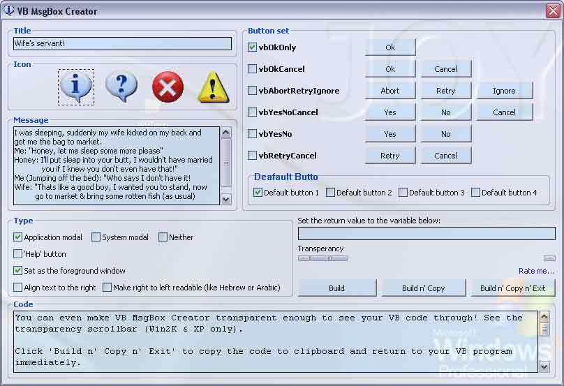



## VB MsgBox Creator

### Description

I think this is the most easy, user friendly & working mssage box wizard for VB. It supports multy line and double quote, it codes as you type! A few mouse clicks, type in your message and it is done! See the screen shot.
 
### More Info
 

             |
---                |---
**Submitted On**   |2003-03-01 01:00:06
**By**             |[Broken Arrow](https://github.com/Planet-Source-Code/PSCIndex/blob/master/ByAuthor/broken-arrow.md)
**Level**          |Beginner
**User Rating**    |4.8 (24 globes from 5 users)
**Compatibility**  |VB 5\.0, VB 6\.0
**Category**       |[Complete Applications](https://github.com/Planet-Source-Code/PSCIndex/blob/master/ByCategory/complete-applications__1-27.md)
**World**          |[Visual Basic](https://github.com/Planet-Source-Code/PSCIndex/blob/master/ByWorld/visual-basic.md)
**Archive File**   |[VB\_MsgBox\_155227312003\.zip](https://github.com/Planet-Source-Code/broken-arrow-vb-msgbox-creator__1-43585/archive/master.zip)

